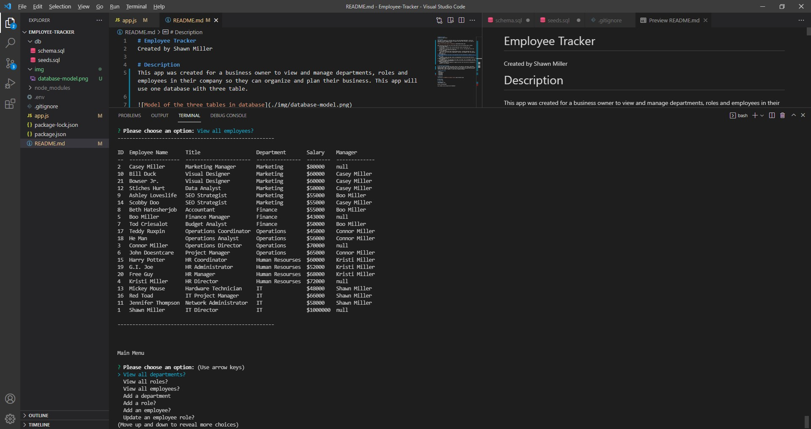

# Employee Tracker
Created by Shawn Miller

# Description
This app was created for a business owner to view and manage departments, roles and employees in their company so they can organize and plan their business. This app will use one database with three table.

When the app is run a user will have seven menus with the following tables created:
1. View all departments
    - Presented a formatted table showing department names and department ids.
2. View all roles
    - Presented a formatted table showing job title, role id, the department that role belongs to, and the salary for that role.
3. View all employees
    - Presented a formatted table showing employee data, including employee ids, first names, last names, job titles, departments, salaries, and managers that the employees report to.
4. Add a department
    - Prompted to enter the name of the department and that department is added to the database.
5. Add a role
    - Prompted to enter the name, salary, and department for the role and that role is added to the database.
6. Add an employee
    - Prompted to enter the employee’s first name, last name, role, and manager, and that employee is added to the database.
7. Update an employee role
    - Prompted to select an employee to update and their new role and this information is updated in the database 

# Installation Instructions
A user will need to download and install node.js, npm Inquirer, npm dotenv, npm mysql2 and npm console.table.  Once installed the user will just need run a 'node app.js' at the command prompt.  When the app starts the user will just need to following the directions from each new prompt to update or create their employee database.

# Technologies Used
- Node.js
- npm Inquirer
- npm dotenv
- npm mysql2
- JavaScript

# Appearance

# Known Bugs
No known bugs.

# Contact info
shawnsmm@gmail.com

github.com/Shawn52409

www.linkedin.com/in/shawn-miller-b44a36217